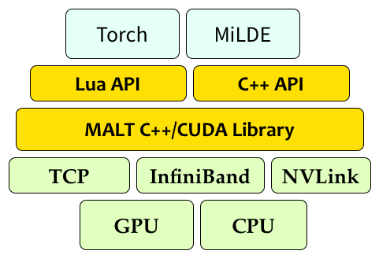

<a href="https://malt2.github.io">MALT-2</a> is a distributed data-parallel 
machine learning system for  [Torch](http://torch.ch) and MiLDE.

MALT-2 is a ML parallelization framework to paralleize any existing ML application.
The system is designed to be simple to use and easy to extend, while
maintaining efficiency and state-of-the-art accuracy.

* Easy to add to existing code <a href="guide">general-purpose interface</a>, requires only changing optimization type to dstsgd (distributed SGD).
* Support for multi-machine, multi-GPU training with CUDA implementations for distributed parameter averaging.
* Includes C++ and Lua interface to extend existing code. Support for Torch and NEC MiLDE (not open-sourced). Support for pytorch and darknet coming soon.
* Easily <a href="torch-apps">extend</a> your existing Torch code with minimal changes. 
* Explore existing distributed GPU  <a href="torch-apps">apps</a> over Resnets, and large language models.
* Various <a href="qa">optimizations</a> such as sparse-reduce, NOTIFY_ACK to accelerate distributed model training.
* Contributions Welcome!
